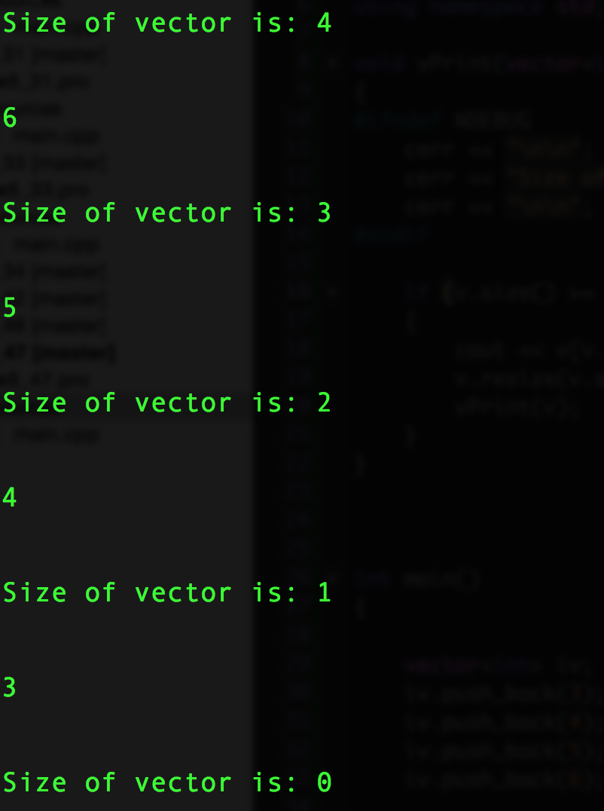

# Chapter 6. Functions

## Exercise 6.1

> What is the difference between a parameter and an argument ?

- The a parameter is a local variable definition in the function scope.
- An argument is the variable sendt in during the function call that initializes the parameter.
- I.e. the difference is that the argument is the initializer and the parameter is the variable getting initialized with the argument value.


## Exercise 6.2

> Indicated which of the following functions are in error and why. Suggest how you might correct the problems.

-
**Question (a)**

```cpp
(a)
int f() {
	string s;
	// ...
	return s;
}
```


**Answer (a)

- The return value is not a string, which  it should be.


```cpp
(a)
string f()
{
	string s;
	// ...
	return s;
}
```
-

**Question (b)**

```cpp
(b)
f2(int i) { /* ... */ }
```

**Answer (b)**

- function is missing a return type
- if it doesnt return anything it should have the return type void.

```cpp

void f2(int i)
{
	/* ... */
}
```
-

**Question (c)**

```cpp
int calc(int v1, int v1) /* ... */ }
```

**Answer (c)**

- both parameter are the same
- the function is missing a starting curly brace

```cpp
int calc(int v1, int v2)
{
	/* ... */
}
```
-

**Question (d)**

```cpp
double square(double x) return x * x;
```

**Answer (d)**

- function is missing it's block, that is it has no curly braces to define it's body

```cpp
double square(double x)
{
	return x * x;
}
```
-

## [Exercise 6.3](ex6_3/main.cpp)

> Write and test your own version of *fact*.


## [Exercise 6.4](ex6_4/main.cpp)

> Write a function that interacts with the user, asking for a number and generating the factorial of that number. Call this function from *main*.

## [Exercise 6.5](ex6_5/main.cpp)

> Write a function to return the absolute value of it's argument.


## Exercise 6.6

> Explain the differences between a parameter, a local variable, and a local static variable. Give an example of a function in which each might be useful.

- a parameter is a local variable that is initialized in the function header by arguments
- a local variale is an object that is initialized only if its definition contains an initializer.
- a local static variable is a variable that does keeps it value after the function call is over.


**parameter**

```cpp
double
convertDollarsToCrowns(double dollars, double convRate) //useful parameters
{
	return dollars * convRate;
}
```

**local variable**

```cpp
int 
factorial(int num)
{
	fact = 1;	// useful local variable
	
	while( num > 1)
		fact *= num--;
}
```


**local static variable**

```cpp
int lastValue(int val)
{
	// static local value useful for implementing memory 
	static int last  = 0;
	
	int temp = last;
	last = val;
	
	return temp;
}

```


## [Exercise 6.7](ex6_7/main.cpp)

> Write a function that returns 0 when it is first called and then generates numbers in sequence each time it is called again.


## Exercise 6.8

> Write a header file named *chapter6.h* that contains declarations for the functions you wrote for the exercises §6.1 (p. 205).

```cpp

// headerFile.h

int f();

void f2(int i);

int calc(int v1, int v2);


double square(double x);

int fact(int val);

void factorialInteraction(int val);

int absoluteValue(int value);
```


## [Exercise 6.10](ex6_10/main.cpp)

> Using pointers, write a function to swap the values of two *int*s. Test the function by calling it and printing the swapped values.


## [Exercise 6.11](ex6_11/main.cpp)

> Write and test your own version of *reset* that takes a reference.


## [Exercise 6.12](ex6_12/main.cpp)

> Rewrite the program from [exercise 6.10](ex6_10/main.cpp) in § 6.2.1 (p.. 210) to use references instead of pointers to swap the value of two *int*s. Which version do you think would be easier to use and why?


 - I think it is easier to use the references
 - because au contraire a pointers, you don't have to think about how to use the methods with references
 - you can just send in the values same way as when you are doing copy by value.


## Exercise 6.13

> Assuming *T* is the name of a type, explain the difference between a function declared as *void f(T)* and *void f(T&)*.

- a function declared as *void f(T)* is a function that copies by value. That is there is no link between the argument and the parameter of the function.
- a function declared as *void f(T&)* is a function that makes a reference to the argument. And hence there is a link between the argument and parameter in the sense that the parameter is a reference to the arguments.


## Exercise 6.14

> Give an example of when a parameter should be a reference type. Give an example of when a parameter should not be a reference.

```cpp
void process(string& text);

void process(int value);
```

## Exercise 6.15

> Explain the rationale for the type of each of *find_char*'s parameters. In particular, why is *s* a reference to *const* but *occurs* is a plain reference? Why are these parameters references, byt the *char* parameter *c* is not? What would happen if we made *s* a plain reference? What if we made *occurs* a reference to *const*?


```cpp
string::size_type find_char(const string& s,
								 char c,
								 string::size_type& occurs)
{
	auto ret = s.size();
	occurs = 0;
	
	for (decltype(ret) i = 0; i != s.size(); ++i)
	{
		if (s[i] == c)
		{
			if (ret == s.size())
				ret = i;
			
			++occurs;
		}
	}
	
	return ret;
}
```


- *s* is reference to const because string is a class type so it could be quite resource intensive to copy the whole value, and it is const because we don't want to change the value in the string
- *occurs* is a plain reference because we want to change *occurs* in the function
- *char c* is not a reference because it is a built-in type and we would not gain any performance by using a reference
- also someimes using references can be a way of returning more than one value from a function.
- if *s* is made a plain reference nothing would happen differently except that the code would be more unclear.
- the program wouldn't work since we are changing *occurs* inside the function


## Exercise 6.16

> The following function, although legal, is less useful than it might be. Identify and correct the limitation on this function:

```cpp
bool is_empty(string& s) { return s.empty(); }
```

- first of all since it does not change the string is should be a const reference.
- second its a function that might be better of just using s.empty() directly.


## [Exercise 6.17](ex6_17/main.cpp)
## [Exercise 6.17b](ex6_17b/main.cpp)

> Write a function to determine whether a *string* contains any capital letters. Write a function to change a *string* to all lowercase. Do the parameters you used in these functions have the same type? If so, why? If not, why not?

- the parameter in the first case is a const string ref, while in the second it's a plain *string&*.
- They are not the same because in the second version we want to change a string to all lower letters while in the first we are only looking to detect capital letters.


## Exercise 6.18

> Write declarations for each of the following functions. When you write these declarations, use the name of the function to indicate what the function does.


**(a)** A function named *compare* that returns a *bool* and has two parameters that are references to a class named *matrix*.

```cpp
bool compare( const Matrix&, const Matrix&);
```

**(b)** A function named *change_val* that returns a *vector<int>* iterator and takes two parameters: One is an *int* and the other is an iterator for a *vector<int>*.

```cpp
vector<int>::iterator change_val(int v, vector<int>::iterator it);
```

## [Exercise 6.19](ex6_19/main.cpp)

> Given the follwoing declarations, determine which calls are legal and which are illegal. For those that are illegal, explain why.

```cpp
double calc(double);

int count(const string&, char);

int sum(vector<int>::iterator, vector<int>::iterator, int);

vector<int> vec(10);
```
-
**(a)** *calc(23.4, 55.1);*

- illegal: trying to use function with more parameters than is defined

-
**(b)** *count("abcda", 'a');*

- legal

-
**(c)** *calc(66);*

- legal: is impl conv to double.

-
**(d)** *sum(vec.begin(), vec.end(), 3.8);*

- legal: with truncated 3.8; (implicitly converted to int)

-

## Exercise 6.20

> When should reference parameters be references to *const* ?
> What happens if we make a parameter a plain reference when it could be a reference to *const* ?


- a parameter should be a reference to *const*, **unless** it is being changed inside the function.

- what happens if we make a parameter a plain reference when it could be a reference to const is:
	- we make the code unclear, as users will think that the reference is changed inside the function
	- we make the code less usable: as now the function can not be used by *const* arguments. (if parameter had been a ref to *const* the function would have handle both *const* and plain arguments.

 
## [Exercise 6.21](ex6_21/main.cpp)

> Write a function that takes an *int* and a pointer to an *int* and returns the larger of the *int* value or the value to which the pointer points. What type should you use for the pointer?

```cpp
int
largest( const int val1, const int* pVal2 )
{
  return (val1 > *pVal2) ? val1 : *pVal2;
}
```

- you should use a *const int* * (a pointer to const int)


## [Exercise 6.22](ex6_22/main.cpp)

> Write a function to swap to *int* pointers.


## [Exercise 6.23](ex6_23/main.cpp)

> Write your own versions of each of the *print* functions presented in this section. Call each of these functions to print *i* and *j* defined as follows:

*int i = 0, j[2] =  {0, 1};


## Exercise 6.24

> Explain the behaviour of the following function. If there are problems in the code, explain what they are and how you might fix them.


```cpp
void print(const int ia[10])
{
	for (size_t i = 0; i != 10; ++i)
		cout << ia[i] << endl;
}
```

- function takes a pointer to const int
- we cant control the size of the array to which the pointer points when passing a pointer.
- use a reference to fix this

```cpp
void print(const int (&ia)[10])
{
	for (size_t i = 0; i != 10; ++i)
		cout << ia[i] << endl;
}
```

## [Exercise 6.25](ex6_25/main.cpp)

> Write a *main* function that takes two arguments. Concatenate the supplied arguments and printe the resulting *string*.


## [Exercise 6.26](ex6_26/main.cpp)

> Write a program that accepts the options presented in this section. Print the values of the arguments passed to main.


## [Exercise 6.27](ex6_27/main.cpp)

> Write a function that takes an *initializer_list<int>* and produces the sum of the elements in the list.

## [Exercise 6.28](ex6_28/main.cpp)

> In the second version of *error_msg* that has an *ErrCode* parameter, what is the type of *elem* in the *for* loop?

- const reference to string ( const string&)


## Exercise 6.29

> When you use an *initializer_list* in a range *for* would you ever use a reference as the loop control variable? If so why if not, why not?

- you would when the initializer list has elements that are to costly to copy

## [Exercise 6.30](ex6_30/main.cpp)

> Compile the version of *str_subrange* as presented on page 223 to see what your compiler does with the indicated errors.

```
error: non-void function 'str_subrange' should return a value 

[-Wreturn-type]
            return; // error
            ^
```

## Exercise 6.31

> When is it valid to return a reference?
> 
> A reference to const?

- The object reffered has to exist before the function was called.


## [Exercise 6.32](ex6_32/main.cpp)

> Indicate whether the following function is legal. If so, explain what it does; if not, correct any errors and then explain it.

- It is legal

- it takes in a pointer to an int, and an int
- it then returns a reference (left side reference) to a position in an array of ints.

## [Exercise 6.33](ex6_33/main.cpp)

> Write a recursive function to print the contents of a *vector*.


## Exercise 6.34 

> What would happen if the stopping condition in *factorial* were
> *if (val != 0)*?

- a few different things :)


## Exercise 6.35

> In the call to *factorial*, why did we pass *val - 1* rather that *val--*?

- Because of predecence *val--* the decrement operator (--) would never take effect.

## Exercise 6.36

> Write the declaration for a function that returns a reference
> to an array of ten *string*s, without using either a trailing return,
> *decltype*, or a type alias

```cpp
std::string (& funct())[10]
```

## Exercise 6.37

> Write three additional declarations for the function in the previous exercise. One should use a type alias, one should se a trailing return, and the third should use *decltype*.

> Which form do you prefer and why?


```cpp
// type alias
using arrR = std::string [10];
arrR& funct();

// trailing return
auto funct() -> std::string(&)[10];

// decltype
std::string a[10] = { "1","2","3","4","5","6","7","8","9","10"};

decltype(a)& funct();

```

- I like the type alias the best because I'm most familiar with this way of doing it.


## Exercise 6.38

> Revise the *arrPtr* function on to return a reference to the array.


```cpp
decltype(odd)& arrPtr(int i)
{
	return (i % 2) ? odd : even;
}
```

## Exercise 6.39

> Explain the effect of the second declaration in each one of the following sets of declarations. Indicate which, if any, are illegal.


**(a)**

```cpp
int calc(int, int);

int calc(const int, const int);
```
- The second declaration is just a redeclaration of the first as far as the compiler is concerned.

- It declares the function with top level consts

-

**(b)**

```cpp
int get();

double get();
```

- The function with *double* as a return type is illegal
- You cannot overload functions with only different return types.

-

**(c)**

```cpp
int* reset(int*);

double* reset(double*);
```

- The effect fo the second declaration is that the compiler sees the function as overloaded.


## Exercise 6.40

> Which, if either, of the following declarations are errors?
> Why?

**(a)**

```cpp
int ff(int a, int b = 0, int c = 0);
```

**(b)**

```cpp
char *init(int ht = 24, int wd, char bkcgrnd);
```

**Answer:**

- Declaration **(b)** is an error
- Because if a parameter is default initialized, all parameters following must also be default initialized.

-

## Exercise 6.41

> Which, if any, of the follwing calls are illegal?
> Why?
> Which, if any, are legal but unlikely to math the programmer's intent?
> Why?


```cpp
char *init(int ht, int wd = 80, char bckgrnd = ' ');
```
**(a)**

```cpp
init();
``` 

**(b)**
```cpp
init(24, 10);
```

**(c)**
```cpp
init(14, '*');
```


**Answer:**

- call **(a)** is illegal
- Because, *init()* function requires an argument for the first parameter, but the call does not include one.
- call **(c)** legal but unlikely to math programmer's expectations
- because the *char* is converted to an int, and if the programmer intended to set **witdh** using an int would normally be clearer and more convenient.


## [Exercise 6.42](ex6_42/main.cpp)

> Give the second parameter of *make_plural*  (§6.3.2, p. 224) a default argument  of *'s'*. Test your program by printing singular and plural versions of the words *success* and *failure*.


## Exercise 6.43

> Which of the following declarations and definitions would you put in a header?
> In a source file?
> Explain why.

**(a)**

```cpp
inline bool eq(const BigInt&, const BigInt&) { ... }
```
**(b)**

```cpp
void putValues(int *arr, int size);
```

**Answers:**

- would put the *eq()* in a header file
	- because it is inlined
- I would put the *putValues()* function declaration in a header, and the body in a source file.
	- because it is the clean way of dealing with prototype and function in.


## [Exercise 6.44](ex6_46/main.cpp)

> Rewrite the *isShorter* function from § 6.2.2 (p. 211) to be *inline*


```cpp
inline bool 
isShorter(const string& s1, const string& s2)
{
	return s1.size() < s2.size();
}
```

## [Exercise 6.45](ex6_45/main.cpp)

> Review the programs you've written for the earlier exercises and decide whether they should be defined as *inline*. If so, do so.
> If not, explaing why they should not be inline.


## [Exercise 6.46](ex6_46/main.cpp)

> Would it be possible to define *isShorter* as a *constexpr*?
> If so, do so. If not, explain why not.

- apparently this is wrong - get back to it later
=========fix
```cpp
constexpr bool
isShorter(const string& s1, const string& s2)
{
    return s1.size() < s2.size();
}
```


=============== fix


## [Exercise 6.47](ex6_47/main.cpp)

> Revise the program you wrote in the exercises in § 6.3.2 (p. 228) that used recursion to print the contents of a *vector* to conditionally print information about it's execution. For example, you might print the size of the *vector* on each call.
> Compile and runthe program with debugging turned on and again with it turned off.


**NDEBUG undefined**



**NDEBUG defined**


## Exercise 6.48

> Explain what this loop does and whether it is a good use of *assert*:


```cpp
string s;
while(cin >> s && s != sought) { }	// empty body
assert(cin);
```


